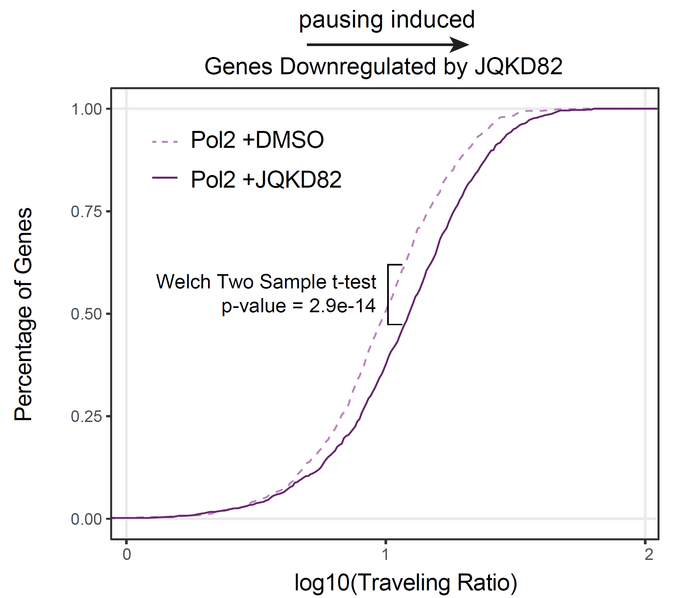
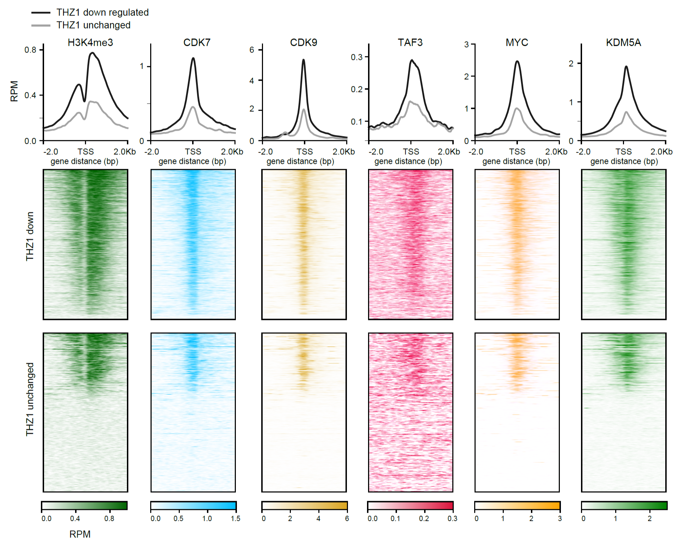

# ChIPseqPipe
Components of an automated ChIPseq and ATACseq pipeline

Downstream pipeline components available here:
https://github.com/CBIIT/ChIP_seq

# Calculating RNA Pol2 Traveling Ratio
added by Berkley E. Gryder, March 2020

Scripts and code protocol for calculating Pause Index (aka Traveling Raio) from Pol2 ChIP-seq data
https://github.com/GryderArt/ChIPseqPipe/tree/master/TravelingRatio

# Plotting TSS heat maps
added by Berkley E. Gryder, Janurary 2021

Scripts, code protocol and video tutorial for plotting ChIP-seq data around gene sets of interest
https://github.com/GryderArt/ChIPseqPipe/tree/master/plotTSSheat

